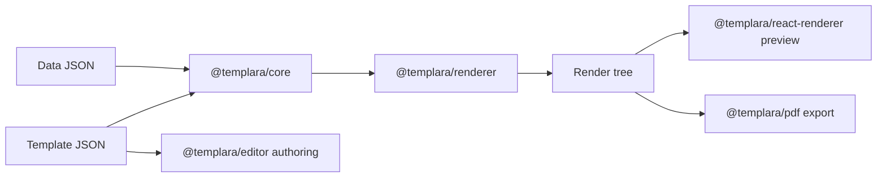

Templara is a browser-native document runtime and visual authoring platform for structured business documents.

It is built for documents where layout matters, data changes, and output needs to be deterministic: invoices, bills of lading, receipts, pay stubs, shipping labels, certificates, and structured reports.

```txt
Design once.
Bind to data.
Render many documents.
```

## The mental model

A Templara document starts as template JSON. The template describes pages, layers, nodes, data bindings, variables, repeat sections, and layout rules.

At authoring time, a user designs the template visually. At output time, Templara combines the same template with JSON data and produces a paginated render tree for preview and export.

For example, an invoice line-items table is authored once:

```txt
Repeat: invoice.items
  Row template:
    {{item.name}}  {{item.quantity}}  {{item.price}}  {{item.total}}
```

In the editor, that repeat stays as one editable row because that is the thing being designed. In preview/export, the renderer resolves `invoice.items`, expands every row, measures what fits, and paginates overflow.

## How the pieces fit together



The architecture has one hard rule: **the editor is not the renderer**.

- The **editor** shows authored template structure on one active page.
- The **editor** shows handlebars like `{{shipment.bolNumber}}`, not final values.
- The **editor** shows a repeat as one editable template row.
- The **renderer** resolves data, expands repeats, evaluates logic, paginates, and produces final output.

This split keeps authoring clean. If the editor expanded 100 invoice rows while you were designing the row template, the canvas would become noisy and ambiguous. The renderer owns that final expansion.

## Who Templara is for

Templara is useful when a product needs document generation as part of its own workflow:

- logistics platforms generating BOLs, labels, and delivery paperwork
- finance and billing tools producing invoices, receipts, and statements
- payroll and HR products generating pay stubs and certificates
- internal tools that need branded PDFs from structured operational data
- SaaS products that want an embeddable template editor instead of hard-coded PDF layouts

## Packages

Templara is a small set of composable packages with strict boundaries.

| Package | Role |
| --- | --- |
| `@templara/core` | Document language: schema, node types, bindings, variables, expressions, validation, and migrations. |
| `@templara/renderer` | Deterministic planning: resolves data, evaluates logic, expands repeats, and paginates into a render tree. |
| `@templara/react-renderer` | Renders the render tree in the browser (`DocumentPreview`). This is the export source. |
| `@templara/editor` | Figma-like authoring surface (`DocumentEditor`). |
| `@templara/pdf` | Browser-first PDF export and pre-flight diagnostics. |
| `@templara/templates` | Ready-made invoice, BOL, receipt, pay stub, and shipping-label templates with sample data. |

## Start with the right path

If you only need to produce documents, start with render-only preview. If you need users to design templates, embed the editor as a controlled component.

```tsx
import { renderDocument } from '@templara/renderer';
import { DocumentPreview } from '@templara/react-renderer';
import { invoiceSampleData, invoiceTemplate } from '@templara/templates';

const document = renderDocument({
  template: invoiceTemplate,
  data: invoiceSampleData,
  mode: 'preview',
});

export function Preview() {
  return <DocumentPreview document={document} />;
}
```

## Where to go next

<Cards>
  <Card title="Quick Start" href="/docs/getting-started/quick-start" />
  <Card title="The document model" href="/docs/core-concepts/document-model" />
  <Card title="Repeats & pagination" href="/docs/core-concepts/repeats-and-pagination" />
  <Card title="Embed the editor" href="/docs/guides/embed-editor" />
</Cards>

## Engineering rules

- Template JSON is the source of truth.
- The editor must not call the final renderer for its design canvas.
- Preview and export resolve data, expand repeats, and paginate.
- Packages should remain embeddable over time.
