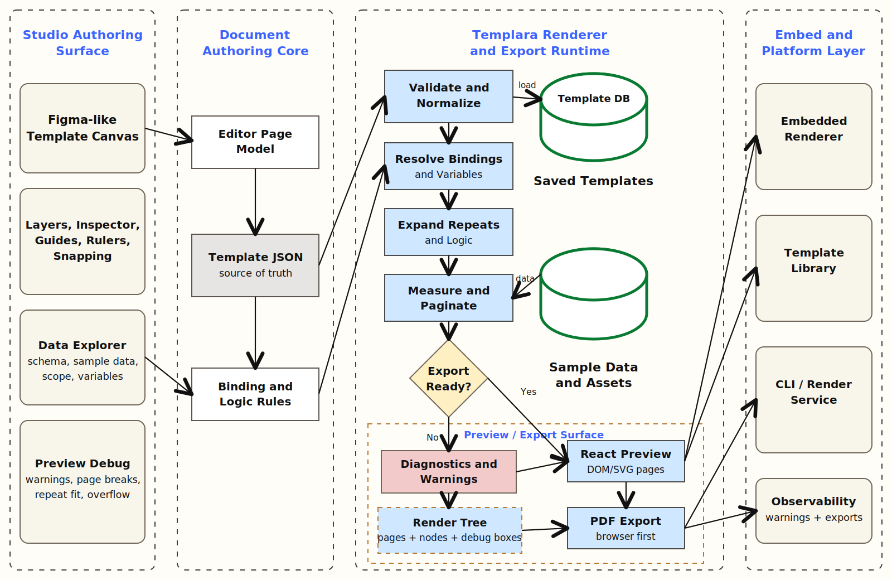

# Templara: Building A Browser-Native Authoring Platform For Structured Documents



Templara started from a simple but very stubborn idea:

```txt
Design once.
Bind to structured data.
Render deterministic business documents.
```

That sounds clean when you say it like that. But the moment you actually try to build it, the problem opens up.

You are not just building a Figma clone. You are not just building a PDF generator. You are not just building an HTML template editor. You are building the place where all three of those worlds meet:

- a visual canvas where people can design business documents
- a structured template language that can survive real data
- a deterministic renderer that knows how to expand repeats, paginate, and export

That is Templara.

The goal is a browser-native visual authoring platform for structured business documents: invoices, shipment BOLs, receipts, paystubs, labels, certificates, delivery notes, and operational reports. The user should be able to edit one template page like a design tool, bind it to JSON data, preview it with real sample data, and export a final document that behaves the same way every time.

This is the architecture we landed on.

## The Product Shape

The cleanest way to understand Templara is this:

```txt
Template JSON + Data JSON
        |
        v
@templara/core
        |
        v
@templara/renderer
        |
        v
Render Tree
        |
        +--> React Preview
        +--> PDF Export
        +--> Image Export
        +--> HTML Export later
```

The editor is one consumer of the document system. It is not the system itself.

That distinction matters because the editor and the renderer have different jobs. The editor is where the user authors the template. The renderer is where the template becomes the final document.

In the editor, a repeat section is one editable template row. In preview, that same repeat section can become 3 rows, 50 rows, or 5 pages. In the editor, a field looks like `{{shipment.bolNumber}}`. In preview, it resolves to the actual BOL number.

That split became one of the most important architectural decisions in the whole product.

## The Core Bet: JSON Is The Source Of Truth

Templara templates are JSON documents.

Not HTML. Not a saved DOM tree. Not screenshots. Not a pile of canvas instructions.

JSON gives the system something stable to validate, migrate, diff, version, package, and render. It also lets the editor and renderer share one document language without sharing interaction state.

A simplified version of the core document shape looks like this:

```ts
export interface DocumentTemplate {
  id: string;
  version: string;
  unit: DocumentUnit;
  pages: PageTemplate[];
  fonts?: FontDefinition[];
  assets?: AssetDefinition[];
  variables?: VariableDefinition[];
  dataSchema?: DataSchema;
  metadata?: Record<string, unknown>;
}

export interface PageTemplate {
  id: string;
  name?: string;
  size: Size;
  margin?: Box;
  layers: PageLayer[];
}

export interface PageLayer {
  id: string;
  kind: "background" | "fixed" | "flow";
  nodes: DocNode[];
}
```

The template is the contract. Every package speaks through it.

The editor reads and mutates template JSON. The renderer reads template JSON and data JSON, then produces a render tree. Exporters consume the render tree. That keeps the system honest.

## Document Pixels

Because Templara is browser-first, the internal unit is a document pixel:

```txt
1 document px = 1 CSS px = 1/96 inch
1 PDF point   = 1/72 inch
1 document px = 0.75 PDF points
```

Current page presets:

```txt
Letter: 816 x 1056 px
A4:     794 x 1123 px
```

This makes canvas editing natural in the browser. PDF conversion happens at the export boundary, where it belongs.

## The Package Architecture

The monorepo is split by responsibility:

```txt
apps/
  studio/              main visual editor product
  playground/          renderer and template experiments
  docs/                documentation site shell

packages/
  core/                document schema, node types, bindings, validation
  renderer/            template + data -> paginated render tree
  react-renderer/      render tree -> React DOM/SVG preview
  editor/              canvas model, tools, layers, inspector, data panel
  pdf/                 browser-first PDF export direction
  assets/              fonts, images, asset helpers
  templates/           starter templates and sample data
  cli/                 future command-line rendering/export
```

The boundaries are deliberate.

`@templara/core` owns the language. `@templara/renderer` owns final output planning. `@templara/editor` owns authoring. `@templara/react-renderer` owns browser display. `@templara/pdf` owns export. `@templara/templates` owns real examples.

The main rule is simple: package boundaries should stop product shortcuts from leaking into engine code.

## Editor And Renderer Are Separate

This is the thing that makes the whole system work.

The editor shows authored structure:

- one active page
- authored nodes
- handlebars for bindings
- one editable repeat row
- no pagination
- no array expansion

Preview/export shows rendered output:

- resolved data
- expanded repeats
- evaluated logic
- continuation pages
- diagnostics and warnings
- final export surfaces

The editor model makes that explicit:

```ts
export function buildEditorPageModel(
  template: DocumentTemplate,
  pageId?: string,
): EditorPageModel {
  const page = findPage(template, pageId);
  const assets = new Map(template.assets?.map((asset) => [asset.id, asset]));
  const nodes = page.layers.flatMap((layer) =>
    renderNodeCollection(layer.nodes, {
      pageId: page.id,
      layerId: layer.id,
      layerKind: layer.kind,
      depth: 0,
      parentPath: `${page.id}.${layer.id}`,
      origin: { x: 0, y: 0 },
      assets,
    }),
  );

  return {
    id: page.id,
    name: page.name ?? page.id,
    size: page.size,
    margin: page.margin,
    nodes,
  };
}
```

Notice what is not happening here: the editor canvas is not calling the final renderer.

That is intentional. If the editor used the preview renderer as its source, a repeat with 100 items would explode across the design canvas. That is not authoring anymore. That is inspection.

## The Renderer Pipeline

The renderer takes a template and data, then returns a render tree:

```ts
export function renderDocument(input: RenderDocumentInput): RenderDocumentResult {
  const state: RenderState = {
    template: input.template,
    data: input.data ?? {},
    mode: input.mode ?? "preview",
    measurement: input.measurement ?? defaultMeasurementProvider,
    assets: new Map(input.template.assets?.map((asset) => [asset.id, asset])),
    fonts: normalizeFonts(input.fonts ?? input.template.fonts ?? []),
    selectedFontFamily: input.fontFamily,
    pages: [],
    warnings: [],
    repeatAnalyses: [],
    variableStack: []
  };

  for (const page of input.template.pages) {
    renderTemplatePage(state, page);
  }

  return {
    pages: state.pages,
    warnings: state.warnings,
    repeatAnalyses: state.repeatAnalyses,
    fonts: state.fonts,
    selectedFontFamily: state.selectedFontFamily
  };
}
```

Conceptually, the renderer pipeline is:

```txt
Validate template
Resolve variables
Resolve bindings
Evaluate conditionals
Expand repeats
Measure content
Layout flow regions
Paginate
Produce render tree
Report warnings
```

The renderer is deterministic and side-effect-free. Same template, same data, same measurement provider, same output.

That is the bar because business documents cannot be vibes-based. A BOL, invoice, label, or paystub has to be repeatable.

## Flow Regions And Pagination

The document model has fixed layers and flow layers.

Fixed nodes stay exactly where the designer placed them: headers, labels, boxes, logos, code blocks, signature lines.

Flow nodes live inside explicit flow regions. They can grow, split, and paginate.

The renderer starts a flow region like this:

```ts
function renderFlowRegion(
  state: RenderState,
  sourcePage: PageTemplate,
  initialPageIndex: number,
  region: FlowRegionNode
): void {
  const continuationTop = sourcePage.margin?.top ?? region.frame.y;
  const continuationBottom = sourcePage.size.height - (sourcePage.margin?.bottom ?? 0);
  const firstPageBottom = resolveFlowRegionBottom(sourcePage, region);
  const context: FlowContext = {
    sourcePage,
    initialPageIndex,
    region,
    continuationTop,
    continuationBottom,
    firstPageBottom
  };

  let cursor: FlowCursor = {
    pageIndex: initialPageIndex,
    y: region.frame.y
  };

  for (const child of region.children) {
    cursor = renderFlowNode(state, context, cursor, child, emptyScope(), {
      x: region.frame.x,
      y: 0
    });
  }
}
```

The important idea is the cursor. The renderer always knows which page it is on and where the next flow item should land. When something does not fit, the renderer can create a continuation page and keep going.

That gives Templara the thing most visual editors do not have: a real layout engine for structured documents.

## Repeats Are The Hard Part

Repeats are where the product becomes real.

A shipment BOL has handling units. An invoice has line items. A receipt has purchases. A paystub has earnings and deductions. A report has rows.

The editor should show one repeat row. The renderer should expand the row for every item in the bound array.

The repeat node captures that:

```ts
export interface RepeatNode extends BaseNode {
  type: "repeat";
  binding: BindingRef;
  itemAlias: string;
  layout: RepeatLayout;
  children: FlowNode[];
  header?: FlowNode[];
  emptyState?: FlowNode[];
}
```

At render time, the repeat binding has to resolve to an array:

```ts
function renderRepeatNode(
  state: RenderState,
  context: FlowContext,
  cursor: FlowCursor,
  node: RepeatNode,
  scope: Scope,
  origin: Pick<Frame, "x" | "y">
): FlowCursor {
  const value = resolveBinding(node.binding, state, scope);
  const items = Array.isArray(value) ? value : [];

  if (!Array.isArray(value)) {
    state.warnings.push({
      code: "binding.repeat_not_array",
      message: `Repeat binding "${node.binding.path}" did not resolve to an array.`,
      nodeId: node.id,
      pageId: context.sourcePage.id
    });
  }

  const baseRows = createRepeatRowPlans(state, node, scope, items);
  // Then the renderer measures rows, fits what it can, and paginates overflow.
}
```

That warning system is part of the architecture. The renderer should not silently fail when the template and data do not agree. It should produce output and tell you exactly what went wrong.

## Data Binding UX

The authoring experience cannot make the user memorize paths all day.

Templara has a data explorer that reads from schema, sample data, repeat scope, and variables. It can decide what fields are bindable to what nodes.

For example, array fields can bind to repeat/grid nodes. Scalar fields can bind to text, barcode, QR, image, and similar value nodes.

```ts
export function isFieldBindableForNode(field: DataExplorerField, node?: EditableNode): boolean {
  if (!field.bindable) {
    return false;
  }

  if (!node) {
    return field.kind !== "array" && field.kind !== "object";
  }

  if (node.type === "repeat" || node.type === "grid") {
    return field.kind === "array";
  }

  if (node.type === "text" || node.type === "barcode" || node.type === "qr" || node.type === "image") {
    return field.kind !== "array" && field.kind !== "object";
  }

  return false;
}
```

This is one of those details that makes the product feel serious. Binding is not just text insertion. Binding is a relationship between the data model and the document model.

## Logic Without Arbitrary JavaScript

Structured documents need logic:

- show this block only if a value exists
- filter repeat items
- format currency
- compute totals
- fall back when a field is missing

But the runtime should not evaluate arbitrary JavaScript from templates. That would make deterministic rendering, security, validation, and portability much harder.

So Templara uses structured expressions:

```ts
export function evaluateExpressionPreview(
  expression: ExpressionRef,
  data: Record<string, unknown>,
): boolean {
  const value = readPath(data, expression.source);
  const comparison = expression.compareSource
    ? readPath(data, expression.compareSource)
    : expression.value;

  switch (expression.operator ?? "truthy") {
    case "truthy":
      return Boolean(value);
    case "exists":
      return value != null && value !== "";
    case "equals":
      return valuesEqual(value, comparison);
    case "greaterThan":
      return compareNumbers(value, comparison, (a, b) => a > b);
    default:
      return false;
  }
}
```

That gives the editor a way to preview logic while keeping the renderer as the final source of truth.

## The Current Stress Test: Shipment BOL

The active template is a Shipment Bill of Lading.

That was a good choice because it forces the architecture to deal with the real problems early:

- business identity fields
- BOL metadata
- shipper, recipient, and delivery blocks
- handling units repeat section
- totals
- instructions
- barcode and QR nodes
- signatures and terms
- fixed layout plus dynamic rows

A small piece of the template shows the document language in action:

```ts
export const shipmentBolTemplate: DocumentTemplate = {
  id: "shipment-bol",
  version: "0.0.1",
  unit: "px",
  metadata: {
    name: "Shipment BOL Template"
  },
  pages: [
    {
      id: "page-1",
      name: "Shipment BOL",
      size: PAGE_PRESETS.letter,
      margin: { top: 48, right: 48, bottom: 48, left: 48 },
      layers: [
        {
          id: "background",
          kind: "background",
          nodes: [
            rect("page-border", 36, 36, 744, 984, "#ffffff", "#cbd5e1"),
            rect("header-band", 36, 36, 744, 112, "#f8fafc", "#cbd5e1")
          ]
        }
      ]
    }
  ]
};
```

This is not a demo-only shape. It is the kind of shape that can become template libraries, saved user templates, embedded renderers, and export services later.

## What We Built Together

The foundation now includes:

- a PNPM monorepo with apps and reusable packages
- a core document schema with pages, layers, fixed nodes, flow nodes, repeats, grids, sections, stacks, conditionals, variables, bindings, barcodes, and QR nodes
- a renderer that resolves bindings, expands repeats, paginates overflow rows, produces warnings, and returns repeat-fit analysis
- a React renderer for browser preview
- an editor model that shows authored nodes without calling the final renderer
- a Studio app with a fixed viewport shell, insert rail, layers, data panel, right inspector, rulers, grid, guides, snapping controls, bottom canvas dock, page switcher, and preview overlay
- data explorer behavior for schema fields, sample data, scoped repeat fields, variables, and binding insertion
- a Shipment BOL template that exercises the important parts of the system

The system is not finished, but the hard shape is there.

The big win is that Templara is no longer just a UI idea. It has a document language, a renderer, editor boundaries, and real package responsibilities.

## The Non-Negotiables

These rules should stay stable:

1. Template JSON is the source of truth.
2. The editor does not use the final renderer for its design canvas.
3. The editor shows authored nodes, handlebars, and one repeat template row.
4. Preview/export resolves data, evaluates logic, expands repeats, paginates, and reports diagnostics.
5. Renderer APIs remain deterministic and side-effect-free.
6. Runtime logic uses structured expressions only. No arbitrary JavaScript evaluation.
7. Pointer interactions commit to history once per gesture, not on every pointer move.
8. Data schema and sample data power the editor UX, but the renderer must still render from template + data alone.
9. Package boundaries matter.

Those decisions are what keep the product from collapsing into a one-off editor.

## What Comes Next

The next product push is about turning the foundation into a tool that feels complete:

- resize handles
- delete, duplicate, nudge, align, group, lock, hide, reorder
- stronger undo/redo transactions
- real inspector controls backed by schema
- more intuitive binding insertion
- visual logic authoring
- hardened repeat pagination
- browser-first PDF export
- save/load template JSON
- package APIs for embedding

The end state is bigger than a document editor.

Templara should become a document operating layer for structured business output. Design teams should be able to author templates visually. Developers should be able to bind real data. Product teams should be able to embed the renderer or editor into their own apps. Operations teams should be able to export documents that are accurate, repeatable, and inspectable.

That is the platform.

Not just a canvas. Not just a renderer. Not just a PDF button.

A browser-native authoring and rendering system for structured business documents.
