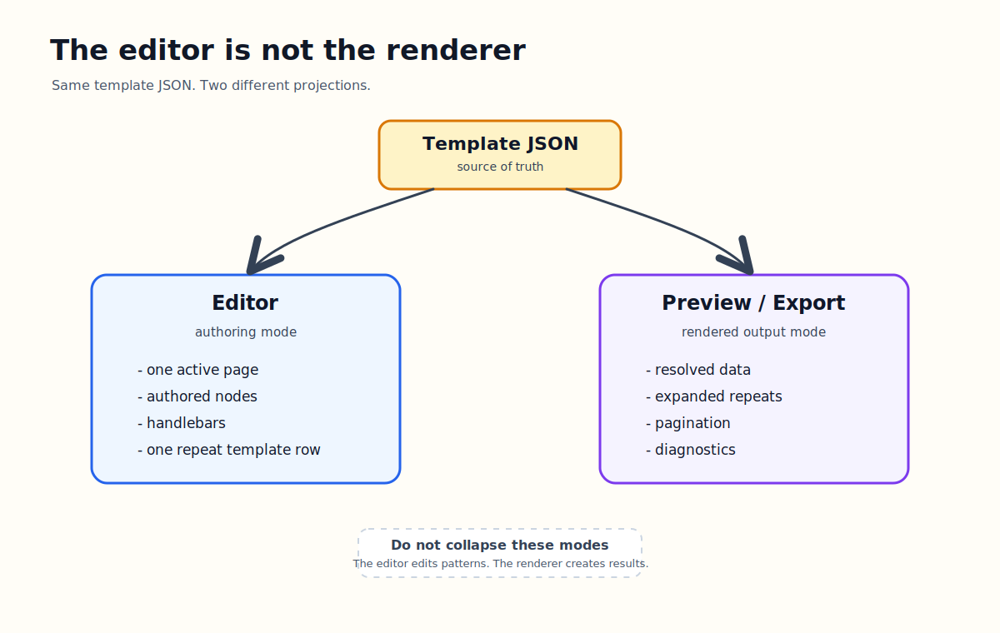

# The Editor Is Not The Renderer



The biggest architecture decision in Templara is also the easiest one to underestimate:

```txt
The editor is not the renderer.
```

That sounds obvious until you build a document tool.

The tempting move is to use one rendering path for everything. Take the template, run it through the renderer, show the result on the canvas, and let the user edit what they see.

That works for simple documents. It breaks down as soon as the document has structured data, repeats, pagination, variables, and logic.

Templara needs two different experiences:

- authoring mode
- preview/export mode

They share the same template JSON, but they do not show the same thing.

## Authoring Mode Shows The Template

The editor is where the user designs the template.

It should show:

- one active page
- authored nodes
- field placeholders
- one repeat template row
- flow region frames
- layers, guides, rulers, selection, and inspectors

It should not show:

- expanded arrays
- generated continuation pages
- final paginated output
- resolved sample data as the only editable state

In other words, the editor should show the thing being designed.

If the user creates a repeat row for `shipment.handlingUnits`, the editor should show the row template. It should not expand all handling units from sample data across the canvas.

That is why the editor has its own page model:

```ts
export interface EditorPageModel {
  id: string;
  name: string;
  size: Size;
  margin?: PageTemplate["margin"];
  nodes: EditorRenderNode[];
}

export function buildEditorPageModel(
  template: DocumentTemplate,
  pageId?: string,
): EditorPageModel {
  const page = findPage(template, pageId);
  const assets = new Map(template.assets?.map((asset) => [asset.id, asset]));
  const nodes = page.layers.flatMap((layer) =>
    renderNodeCollection(layer.nodes, {
      pageId: page.id,
      layerId: layer.id,
      layerKind: layer.kind,
      depth: 0,
      parentPath: `${page.id}.${layer.id}`,
      origin: { x: 0, y: 0 },
      assets,
    }),
  );

  return {
    id: page.id,
    name: page.name ?? page.id,
    size: page.size,
    margin: page.margin,
    nodes,
  };
}
```

The key detail is that this path walks authored template nodes. It is not calling `renderDocument`.

## Preview And Export Show The Result

Preview/export has a different job.

It should show:

- resolved field values
- expanded repeats
- evaluated conditionals
- computed variables
- measured content
- page breaks
- continuation pages
- warnings and diagnostics

That is the final output path:

```ts
export function renderDocument(input: RenderDocumentInput): RenderDocumentResult {
  const state: RenderState = {
    template: input.template,
    data: input.data ?? {},
    mode: input.mode ?? "preview",
    measurement: input.measurement ?? defaultMeasurementProvider,
    assets: new Map(input.template.assets?.map((asset) => [asset.id, asset])),
    fonts: normalizeFonts(input.fonts ?? input.template.fonts ?? []),
    selectedFontFamily: input.fontFamily,
    pages: [],
    warnings: [],
    repeatAnalyses: [],
    variableStack: []
  };

  for (const page of input.template.pages) {
    renderTemplatePage(state, page);
  }

  return {
    pages: state.pages,
    warnings: state.warnings,
    repeatAnalyses: state.repeatAnalyses,
    fonts: state.fonts,
    selectedFontFamily: state.selectedFontFamily
  };
}
```

This path is about output, not manipulation. It takes the template and data, then produces a render tree.

The React preview can display that render tree:

```ts
export interface DocumentPreviewProps {
  document: RenderDocumentResult;
  scale?: number;
  className?: string;
  showDebug?: boolean;
  selectedSourceNodeId?: string;
  onNodePointerDown?: (event: PointerEvent<HTMLElement>, node: RenderNode) => void;
  onPagePointerDown?: (event: PointerEvent<HTMLElement>, page: RenderPage) => void;
}
```

The preview renderer is downstream from layout. It paints the result. It does not decide what the template means.

## Why One Path Breaks

A single render path sounds simpler, but it creates bad product behavior.

Imagine editing an invoice line item row. If the canvas uses final rendered output, sample data might generate 30 rows. Which row is the template? If the user moves the third rendered row, did they move the row template or only that one data instance?

Now add pagination. If a repeat overflows onto page 2, should the user be editing the continuation page? If they drag a row on page 2, should that change the template row on page 1?

Now add missing data. If a field is empty, does the node disappear from the editable canvas? How does the user select it and fix the binding?

These are not edge cases. They are the normal cases for structured business documents.

So Templara separates the modes:

```txt
Editor:
  template JSON -> authored page model -> design canvas

Preview/export:
  template JSON + data JSON -> render tree -> preview/PDF
```

Same source. Different projections.

## Repeats Make The Decision Obvious

Repeats are the clearest example.

The template stores a repeat node:

```ts
export interface RepeatNode extends BaseNode {
  type: "repeat";
  binding: BindingRef;
  itemAlias: string;
  layout: RepeatLayout;
  children: FlowNode[];
  header?: FlowNode[];
  emptyState?: FlowNode[];
}
```

In the editor, that node is one editable container. The user designs the row once.

In the renderer, that node resolves its binding, creates row plans, measures them, and paginates the overflow:

```ts
function renderRepeatNode(
  state: RenderState,
  context: FlowContext,
  cursor: FlowCursor,
  node: RepeatNode,
  scope: Scope,
  origin: Pick<Frame, "x" | "y">
): FlowCursor {
  const value = resolveBinding(node.binding, state, scope);
  const items = Array.isArray(value) ? value : [];

  if (!Array.isArray(value)) {
    state.warnings.push({
      code: "binding.repeat_not_array",
      message: `Repeat binding "${node.binding.path}" did not resolve to an array.`,
      nodeId: node.id,
      pageId: context.sourcePage.id
    });
  }

  const baseRows = createRepeatRowPlans(state, node, scope, items);
}
```

The same template node has two different visual meanings:

- in authoring, it is a pattern
- in preview, it is a generated result

Mixing those meanings makes the product confusing.

## Handlebars Are An Authoring Feature

In the editor, bindings should be visible as placeholders:

```txt
{{business.name}}
{{shipment.bolNumber}}
{{shipment.handlingUnits[].description}}
```

That is not a limitation. It is useful.

The user needs to know what they are designing. If every field is replaced with sample data in the authoring canvas, the template becomes less visible.

Preview can resolve:

```txt
Northstar Logistics
BOL-10492
Industrial printer parts
```

Editor can show:

```txt
{{business.name}}
{{shipment.bolNumber}}
{{item.description}}
```

Both are correct. They answer different questions.

## Pagination Belongs To Preview

Pagination is output behavior.

The editor can show flow regions and repeat frames, but it should not create continuation pages while the user is designing a single template page. The renderer owns page break decisions because those decisions depend on data, measurement, fonts, row heights, and available page space.

That separation also makes diagnostics possible. The renderer can report:

- unbreakable content overflow
- repeat binding is not an array
- unsupported flow root
- missing generated code value
- unresolved image source

The PDF package can then turn those renderer warnings into export preflight results.

```ts
export function collectExportDiagnostics(
  document: RenderDocumentResult,
): ExportPreflight {
  const diagnostics: ExportDiagnostic[] = [];

  for (const warning of document.warnings) {
    diagnostics.push({
      code: warning.code,
      severity: BLOCKING_WARNING_CODES.has(warning.code)
        ? "error"
        : "warning",
      message: warning.message,
      nodeId: warning.nodeId,
      pageId: warning.pageId,
    });
  }
}
```

That pipeline only stays clean if preview/export has a separate rendering step.

## The Rule

The rule we landed on is:

```txt
The editor edits authored template JSON.
The renderer renders template JSON with data.
The preview displays renderer output.
The exporter exports renderer output.
```

That keeps every mode honest.

The editor is allowed to be interactive, contextual, forgiving, and optimized for manipulation. The renderer is allowed to be deterministic, diagnostic-heavy, and optimized for final output. The preview is allowed to show truth with sample data. The exporter is allowed to block or warn when the output is unreliable.

Templara works because those jobs do not collapse into one another.

The editor is not the renderer. That is the architecture.
