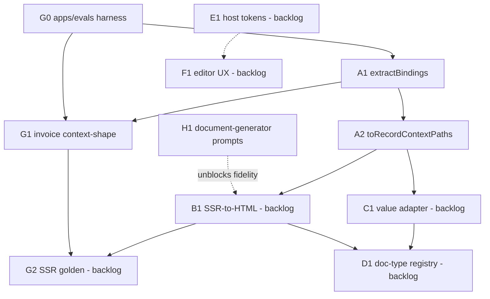

# Orchestration tickets — index

**Integration branch:** `integration/rr-doc-builder-2`  
**Plan:** [orchestration-plan.md](../../orchestration-plan.md) §6 template / §9–10 streams  
**Wave:** Wave 1 (kickoff + first contracts). Full tickets below; later streams are backlog stubs.

## Dependency graph

Rough order (orchestration §9): **H** (parallel, external) + **G0→G1** + **A1→A2** first → then B/C → D/E/F.

## Status table

| ID | Title | Stream | Depends on | Status | Branch |
| --- | --- | --- | --- | --- | --- |
| [G0](G0-evals-harness.md) | `apps/evals` package + Vitest | G | — | ready | `chore/eval-harness-setup` |
| [G1](G1-invoice-context-shape.md) | Invoice context-shape / fixture contract tests | G | G0 | ready | `chore/eval-harness-setup` |
| [A1](A1-extract-bindings.md) | `extractBindings` in `@templara/core` | A | — | ready | `feat/binding-path-extractor` |
| [A2](A2-to-record-context-paths.md) | `toRecordContextPaths` ↔ P3 `normalizeRecordPaths` | A | A1 | ready | `feat/binding-path-extractor` |
| [H1](H1-document-generator-discovery.md) | `document-generator` discovery prompt pack | H | — | ready | n/a (external repo) |
| [G2](backlog.md#g2) | SSR golden / HTML fidelity harness | G | G1, B1 | backlog | — |
| [A3](backlog.md#a3) | Real-record preview wiring (host) | A | A2 | backlog | — |
| [B1](backlog.md#b1) | Node-safe SSR-to-HTML entrypoint | B | A1 | backlog | — |
| [C1](backlog.md#c1) | Value adapter / suffix allowlist parity | C | A2 | backlog | — |
| [D1](backlog.md#d1) | Doc-type registry parity | D | A2, B1 | backlog | — |
| [E1](backlog.md#e1) | Host design-token inheritance | E | — | backlog | — |
| [F1](backlog.md#f1) | Editor UX field-test fixes | F | — | backlog | — |

**Status values:** `ready` · `in_progress` · `blocked` · `done` · `backlog`

## Wave 1 merge gate

Before marking Wave 1 complete on `integration/rr-doc-builder-2`:

1. G0 + G1 merged (evals run under `pnpm test`).
2. A1 (+ A2 if in-wave) merged with Changeset on `@templara/core`.
3. `pnpm typecheck && pnpm test && pnpm build` green.
4. H1 prompt pack committed and runnable in `RoseRocket/document-generator` (no Templara code required).

## Files in this folder

| File | Kind |
| --- | --- |
| [G0-evals-harness.md](G0-evals-harness.md) | Full §6 ticket |
| [G1-invoice-context-shape.md](G1-invoice-context-shape.md) | Full §6 ticket |
| [A1-extract-bindings.md](A1-extract-bindings.md) | Full §6 ticket |
| [A2-to-record-context-paths.md](A2-to-record-context-paths.md) | Full §6 ticket |
| [H1-document-generator-discovery.md](H1-document-generator-discovery.md) | Full §6 ticket (+ prompt pack at [document-generator-prompts.md](../../discovery/document-generator-prompts.md)) |
| [backlog.md](backlog.md) | Stubs for B/C/D/E/F and remaining A/G |
