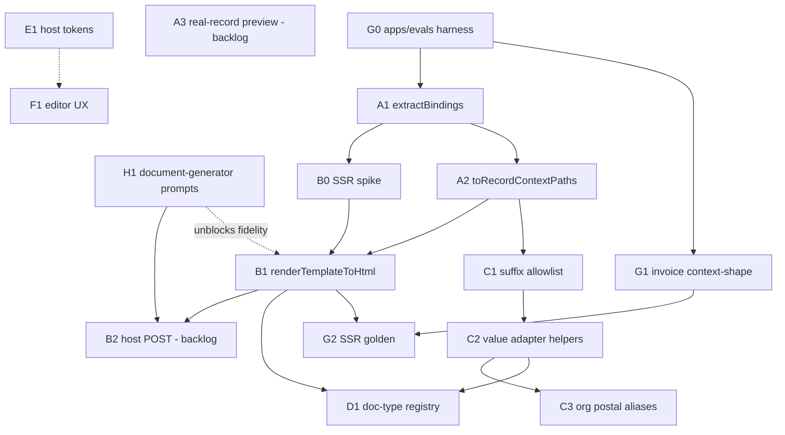

# Orchestration tickets — index

**Integration branch:** `integration/rr-doc-builder-2-wave4`  
**Plan:** [orchestration-plan.md](../../orchestration-plan.md) §6 template / §9–10 streams  
**Wave:** Wave 4 (E1 host tokens + F1 editor UX). Waves 1–3 merged to `main` (PRs #2–#5).

## Dependency graph

Rough order: Waves 1–3 done → Wave 4 **E1 + F1** (D1 host-owned) → Wave 5 **D1 host / A3 / B2 / F3–F5**.

## Status table

| ID | Title | Stream | Depends on | Status | Branch |
| --- | --- | --- | --- | --- | --- |
| [G0](G0-evals-harness.md) | `apps/evals` package + Vitest | G | — | done | merged `main` (PR #2) |
| [G1](G1-invoice-context-shape.md) | Invoice context-shape / fixture contract tests | G | G0 | done | merged `main` (PR #2) |
| [A1](A1-extract-bindings.md) | `extractBindings` in `@templara/core` | A | — | done | merged `main` (PR #2) |
| [A2](A2-to-record-context-paths.md) | `toRecordContextPaths` ↔ P3 `normalizeRecordPaths` | A | A1 | done | merged `main` (PR #2) |
| [H1](H1-document-generator-discovery.md) | `document-generator` discovery prompt pack | H | — | ready | n/a (external repo) |
| [C1](C1-suffix-allowlist.md) | P3 formatting suffix allowlist in core | C | A2 | done | merged `main` (PR #4) |
| [C2](C2-value-adapter-helpers.md) | Pre-formatted suffix value-adapter helpers | C | C1 | done | merged `main` (PR #4) |
| [B0](B0-ssr-html-spike.md) | SSR-to-HTML spike / design note | B | A1 | done | merged `main` (PR #4) |
| [B1](B1-render-template-to-html.md) | `renderTemplateToHtml` Node-safe entry | B | B0 | done | merged `main` (PR #4) |
| [G2](G2-invoice-ssr-golden.md) | Templara invoice SSR golden + discovery HTML contract | G | G1, B1 | done | merged `main` (PR #5) |
| [C3](C3-org-postal-aliases.md) | Org address `postal` ↔ `postalCode` adapter aliases | C | C2 | done | merged `main` (PR #5) |
| [D1](D1-doc-type-registry.md) | Doc-type registry parity (host) | D | A2, B1 | ready | Wave 5 host (ticket/spec only) |
| [E1](E1-host-design-tokens.md) | Host design-token inheritance | E | — | done | `integration/rr-doc-builder-2-wave4` |
| [F1](F1-editor-ux-field-test.md) | Editor UX field-test (canvas defaults + brand) | F | — | done | `integration/rr-doc-builder-2-wave4` |
| [A3](backlog.md#a3) | Real-record preview wiring (host + optional Templara seam) | A | A2 | backlog | Wave 5+ |
| [B2](backlog.md#b2) | Host POST generate-document integration | B | B1, H1 | backlog | Wave 5+ (host) |
| [F3](backlog.md#f3) | Dropdown / popover overflow + sizing | F | F1 | backlog | Wave 5+ |
| [F4](backlog.md#f4) | Human-readable layer names | F | F1 | backlog | Wave 5+ |
| [F5](backlog.md#f5) | Large schema / data panel search & scale | F | F1 | backlog | Wave 5+ |

**Status values:** `ready` · `in_progress` · `blocked` · `done` · `backlog`

## Wave 4 merge gate

Before marking Wave 4 complete on `integration/rr-doc-builder-2-wave4`:

1. F1: canvas layout aids default off; tests + changeset.
2. E1: `HostDesignTokens` + CSS var bridge; `embedded` / `hideBrand`; tests + README + changeset.
3. Tickets README/backlog updated; remaining UX/data work ticketed (not silently closed).
4. `pnpm typecheck && pnpm test` green for `@templara/editor`.
5. Do **not** invent platform-model POSTs or host doc-type registry implementations in this repo (D1/B2 stay host-owned).

## Files in this folder

| File | Kind |
| --- | --- |
| [G0-evals-harness.md](G0-evals-harness.md) | Full §6 ticket (Wave 1, done) |
| [G1-invoice-context-shape.md](G1-invoice-context-shape.md) | Full §6 ticket (Wave 1, done) |
| [A1-extract-bindings.md](A1-extract-bindings.md) | Full §6 ticket (Wave 1, done) |
| [A2-to-record-context-paths.md](A2-to-record-context-paths.md) | Full §6 ticket (Wave 1, done) |
| [H1-document-generator-discovery.md](H1-document-generator-discovery.md) | Full §6 ticket (+ prompt pack) |
| [C1-suffix-allowlist.md](C1-suffix-allowlist.md) | Full §6 ticket (Wave 2, done) |
| [C2-value-adapter-helpers.md](C2-value-adapter-helpers.md) | Full §6 ticket (Wave 2, done) |
| [B0-ssr-html-spike.md](B0-ssr-html-spike.md) | Full §6 ticket (Wave 2, done) |
| [B1-render-template-to-html.md](B1-render-template-to-html.md) | Full §6 ticket (Wave 2, done) |
| [G2-invoice-ssr-golden.md](G2-invoice-ssr-golden.md) | Full §6 ticket (Wave 3, done) |
| [C3-org-postal-aliases.md](C3-org-postal-aliases.md) | Full §6 ticket (Wave 3, done) |
| [D1-doc-type-registry.md](D1-doc-type-registry.md) | Full §6 ticket (host Wave 5; Templara ticket/spec only) |
| [E1-host-design-tokens.md](E1-host-design-tokens.md) | Full §6 ticket (Wave 4, done) |
| [F1-editor-ux-field-test.md](F1-editor-ux-field-test.md) | Full §6 ticket (Wave 4, done) |
| [backlog.md](backlog.md) | Remaining stubs (A3, B2, F2–F6, …) |
