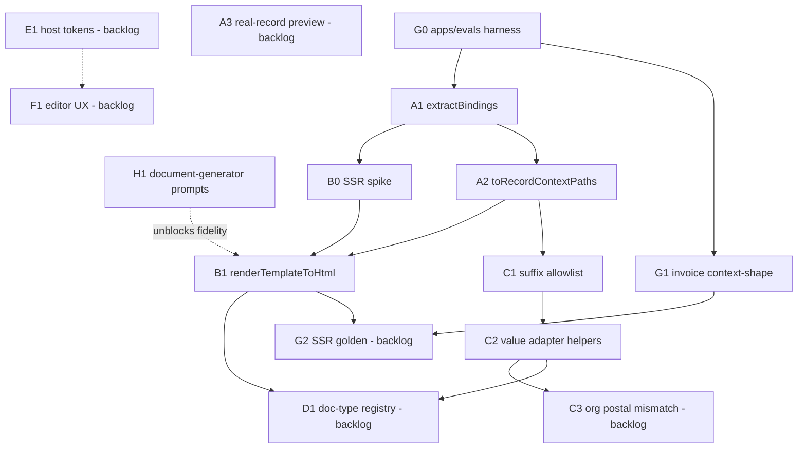

# Orchestration tickets — index

**Integration branch:** `integration/rr-doc-builder-2-wave2`  
**Plan:** [orchestration-plan.md](../../orchestration-plan.md) §6 template / §9–10 streams  
**Wave:** Wave 2 (value adapter + A′-lite SSR). Wave 1 (A/G0/G1) is merged to `main` via PR #2; grid walker via PR #3.

## Dependency graph

Rough order: Wave 1 done → Wave 2 **C1→C2** and **B0→B1** → then D/E/F; G2 after B1; H1 parallel external.

## Status table

| ID | Title | Stream | Depends on | Status | Branch |
| --- | --- | --- | --- | --- | --- |
| [G0](G0-evals-harness.md) | `apps/evals` package + Vitest | G | — | done | merged `main` (PR #2) |
| [G1](G1-invoice-context-shape.md) | Invoice context-shape / fixture contract tests | G | G0 | done | merged `main` (PR #2) |
| [A1](A1-extract-bindings.md) | `extractBindings` in `@templara/core` | A | — | done | merged `main` (PR #2) |
| [A2](A2-to-record-context-paths.md) | `toRecordContextPaths` ↔ P3 `normalizeRecordPaths` | A | A1 | done | merged `main` (PR #2) |
| [H1](H1-document-generator-discovery.md) | `document-generator` discovery prompt pack | H | — | ready | n/a (external repo) |
| [C1](C1-suffix-allowlist.md) | P3 formatting suffix allowlist in core | C | A2 | done | `integration/rr-doc-builder-2-wave2` |
| [C2](C2-value-adapter-helpers.md) | Pre-formatted suffix value-adapter helpers | C | C1 | done | `integration/rr-doc-builder-2-wave2` |
| [B0](B0-ssr-html-spike.md) | SSR-to-HTML spike / design note | B | A1 | done | `integration/rr-doc-builder-2-wave2` |
| [B1](B1-render-template-to-html.md) | `renderTemplateToHtml` Node-safe entry | B | B0 | done | `integration/rr-doc-builder-2-wave2` |
| [G2](backlog.md#g2) | SSR golden / HTML fidelity harness | G | G1, B1 | backlog | — |
| [A3](backlog.md#a3) | Real-record preview wiring (host) | A | A2 | backlog | — |
| [C3](backlog.md#c3) | Org address `postal` vs `postalCode` guard | C | C2 | backlog | — |
| [B2](backlog.md#b2) | Host POST generate-document integration | B | B1, H1 | backlog | — |
| [D1](backlog.md#d1) | Doc-type registry parity | D | A2, B1 | backlog | — |
| [E1](backlog.md#e1) | Host design-token inheritance | E | — | backlog | — |
| [F1](backlog.md#f1) | Editor UX field-test fixes | F | — | backlog | — |

**Status values:** `ready` · `in_progress` · `blocked` · `done` · `backlog`

## Wave 2 merge gate

Before marking Wave 2 complete on `integration/rr-doc-builder-2-wave2`:

1. C1 (+ C2 if in-wave) merged with Changeset on `@templara/core`.
2. B0 findings recorded; B1 `renderTemplateToHtml` (or named equivalent) with smoke test + Changeset on `@templara/react-renderer`.
3. Evals rewired off local suffix duplicate; SSR smoke green under `pnpm test`.
4. `pnpm typecheck && pnpm test && pnpm build` green.
5. Do **not** require D/E/F/H or G2 invoice HTML golden in this wave.

## Files in this folder

| File | Kind |
| --- | --- |
| [G0-evals-harness.md](G0-evals-harness.md) | Full §6 ticket (Wave 1, done) |
| [G1-invoice-context-shape.md](G1-invoice-context-shape.md) | Full §6 ticket (Wave 1, done) |
| [A1-extract-bindings.md](A1-extract-bindings.md) | Full §6 ticket (Wave 1, done) |
| [A2-to-record-context-paths.md](A2-to-record-context-paths.md) | Full §6 ticket (Wave 1, done) |
| [H1-document-generator-discovery.md](H1-document-generator-discovery.md) | Full §6 ticket (+ prompt pack) |
| [C1-suffix-allowlist.md](C1-suffix-allowlist.md) | Full §6 ticket (Wave 2) |
| [C2-value-adapter-helpers.md](C2-value-adapter-helpers.md) | Full §6 ticket (Wave 2) |
| [B0-ssr-html-spike.md](B0-ssr-html-spike.md) | Full §6 ticket (Wave 2) |
| [B1-render-template-to-html.md](B1-render-template-to-html.md) | Full §6 ticket (Wave 2) |
| [backlog.md](backlog.md) | Stubs for remaining A/B/C/D/E/F/G |
