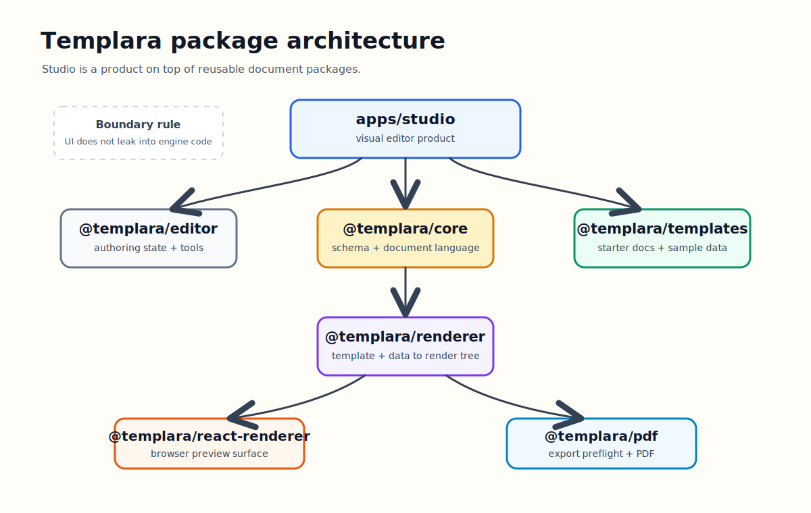

# The Templara Package Architecture



Templara is not one app with a lot of folders.

It is a document system with a Studio product sitting on top of it. That distinction is why the repo is split into packages. The goal is to keep the authoring experience fast, the renderer deterministic, the export path inspectable, and the document language reusable outside the Studio app.

The architecture looks like this:

```txt
apps/studio
    |
    +--> @templara/editor
    +--> @templara/react-renderer
    +--> @templara/templates
    |
    v
@templara/core  <--- shared document language
    |
    v
@templara/renderer
    |
    +--> @templara/react-renderer
    +--> @templara/pdf
```

The important thing is that `core` sits underneath everything. The editor does not own the template language. The renderer does not own the authoring state. The PDF package does not know how selection works. Each package has one job.

## Why Split It This Way

The product asks for several different modes of thinking:

- authoring a template
- validating a template
- binding structured data
- rendering final output
- displaying preview pages
- exporting PDF
- shipping starter templates
- eventually embedding pieces of the system elsewhere

If all of that lives inside one application package, it becomes hard to know which behavior is product UI and which behavior is document infrastructure.

Templara needs clean boundaries because it wants to become both:

- a usable visual editor
- an embeddable document rendering system

That means a product can eventually import the renderer without importing Studio, or use the schema without adopting the whole editor.

## `@templara/core`: The Document Language

`core` owns the types and rules that the rest of the system speaks.

It defines the template, pages, layers, nodes, bindings, variables, expressions, page presets, validation, and migrations.

The document shape starts here:

```ts
export interface DocumentTemplate {
  id: string;
  version: string;
  unit: DocumentUnit;
  pages: PageTemplate[];
  fonts?: FontDefinition[];
  assets?: AssetDefinition[];
  variables?: VariableDefinition[];
  dataSchema?: DataSchema;
  metadata?: Record<string, unknown>;
}

export interface PageLayer {
  id: string;
  kind: "background" | "fixed" | "flow";
  nodes: DocNode[];
}
```

That package is intentionally boring in the best way. It should not know about React. It should not know about pointer events. It should not know about export modals. It gives every other package a shared language.

The long-term strength of Templara depends on this package staying disciplined. Once the schema is stable, templates can be validated, migrated, versioned, saved, diffed, packaged, and rendered across environments.

## `@templara/renderer`: Template Plus Data To Render Tree

The renderer owns final output planning.

Its job is to take template JSON and data JSON, resolve the dynamic parts, paginate the result, and return a render tree with warnings and diagnostics.

The public entry point is deliberately small:

```ts
export function renderDocument(input: RenderDocumentInput): RenderDocumentResult {
  const state: RenderState = {
    template: input.template,
    data: input.data ?? {},
    mode: input.mode ?? "preview",
    measurement: input.measurement ?? defaultMeasurementProvider,
    assets: new Map(input.template.assets?.map((asset) => [asset.id, asset])),
    fonts: normalizeFonts(input.fonts ?? input.template.fonts ?? []),
    selectedFontFamily: input.fontFamily,
    pages: [],
    warnings: [],
    repeatAnalyses: [],
    variableStack: []
  };

  for (const page of input.template.pages) {
    renderTemplatePage(state, page);
  }

  return {
    pages: state.pages,
    warnings: state.warnings,
    repeatAnalyses: state.repeatAnalyses,
    fonts: state.fonts,
    selectedFontFamily: state.selectedFontFamily
  };
}
```

This package should not care whether the output is shown in a React preview, downloaded as a PDF, or inspected in a test. It produces the plan.

That plan includes:

- pages
- absolute render nodes
- resolved text
- resolved images
- barcode and QR values
- debug boxes
- repeat-fit analysis
- warnings

The renderer is where dynamic document behavior belongs: binding resolution, repeat expansion, flow layout, pagination, conditionals, formulas, and diagnostics.

## `@templara/editor`: Authoring, Not Final Output

The editor owns the design-time experience.

That includes:

- active page modeling
- selection
- layers
- inspector state
- insert tools
- snapping
- guides
- rulers
- data explorer behavior
- binding insertion
- drag, resize, nudge, align, and history semantics

The critical boundary is that the editor canvas shows authored template structure. It does not call the final renderer to draw the design canvas.

The editor builds its own page model:

```ts
export function buildEditorPageModel(
  template: DocumentTemplate,
  pageId?: string,
): EditorPageModel {
  const page = findPage(template, pageId);
  const assets = new Map(template.assets?.map((asset) => [asset.id, asset]));
  const nodes = page.layers.flatMap((layer) =>
    renderNodeCollection(layer.nodes, {
      pageId: page.id,
      layerId: layer.id,
      layerKind: layer.kind,
      depth: 0,
      parentPath: `${page.id}.${layer.id}`,
      origin: { x: 0, y: 0 },
      assets,
    }),
  );

  return {
    id: page.id,
    name: page.name ?? page.id,
    size: page.size,
    margin: page.margin,
    nodes,
  };
}
```

That keeps authoring usable. A repeat section stays as one row in Studio even if preview data has 100 items. The editor remains a design tool. Preview remains the rendered result.

## `@templara/react-renderer`: Render Tree To Browser Preview

The React renderer owns browser display of the render tree.

It does not expand repeats. It does not evaluate bindings. It does not paginate. By the time this package receives a document, the renderer has already made those decisions.

Its job is to paint pages and nodes:

```ts
export interface DocumentPreviewProps {
  document: RenderDocumentResult;
  scale?: number;
  className?: string;
  showDebug?: boolean;
  selectedSourceNodeId?: string;
  onNodePointerDown?: (event: PointerEvent<HTMLElement>, node: RenderNode) => void;
  onPagePointerDown?: (event: PointerEvent<HTMLElement>, page: RenderPage) => void;
}
```

This package is also where browser-specific rendering details belong:

- page surfaces
- absolute positioned render nodes
- debug overlays
- font imports
- barcode and QR browser rendering hooks
- preview selection outlines

It is deliberately downstream from the renderer. That makes the renderer testable without a browser and keeps React display concerns out of layout planning.

## `@templara/pdf`: Export Readiness And Browser PDF Direction

The PDF package owns export concerns.

The current direction is browser-first PDF export. Before export, the system should inspect the rendered document and tell the user whether the output is safe to download.

That starts with export diagnostics:

```ts
export function collectExportDiagnostics(
  document: RenderDocumentResult,
): ExportPreflight {
  const diagnostics: ExportDiagnostic[] = [];

  if (document.pages.length === 0) {
    diagnostics.push({
      code: "export.empty_document",
      severity: "error",
      message: "The document has no pages to export.",
    });
  }

  for (const warning of document.warnings) {
    diagnostics.push({
      code: warning.code,
      severity: BLOCKING_WARNING_CODES.has(warning.code)
        ? "error"
        : "warning",
      message: warning.message,
      nodeId: warning.nodeId,
      pageId: warning.pageId,
    });
  }
}
```

That is the right shape. Export should not be a blind print button. It should understand unresolved images, unresolved codes, layout overflow, missing pages, and blocking renderer warnings.

Later, this package can grow into a vector PDF backend or server/CLI export path. The boundary stays the same: it consumes rendered documents, not editor state.

## `@templara/templates`: Real Documents As Product Pressure

Templates are not just examples. They are pressure tests.

The current active template is a Shipment BOL. That is useful because it forces the system to handle real document requirements:

- fixed headers
- business identity
- nested address blocks
- line-item repeats
- totals
- special instructions
- barcode and QR nodes
- signature and terms areas

The template package gives the rest of the system concrete inputs:

```ts
export const shipmentBolTemplate: DocumentTemplate = {
  id: "shipment-bol",
  version: "0.0.1",
  unit: "px",
  metadata: {
    name: "Shipment BOL Template"
  },
  fonts,
  pages: [
    {
      id: "page-1",
      name: "Shipment BOL",
      size: PAGE_PRESETS.letter,
      margin: { top: 48, right: 48, bottom: 48, left: 48 },
      layers: []
    }
  ]
};
```

Good templates expose weak abstractions faster than synthetic tests. If the BOL is painful to author, bind, preview, or export, the product is telling us where the architecture needs work.

## Why The Boundaries Matter

The most important architecture rule is this:

```txt
Editor state should not leak into renderer semantics.
Renderer behavior should not leak into authoring state.
Export should consume render output, not templates directly.
```

That gives Templara room to grow.

Studio can become more sophisticated without destabilizing the renderer. The renderer can get better pagination without rewriting the editor. PDF export can harden without knowing how a toolbar works. Templates can evolve into a library without becoming app code.

That is the point of the package architecture.

Templara is a product today, but the package boundaries are how it becomes a platform.
