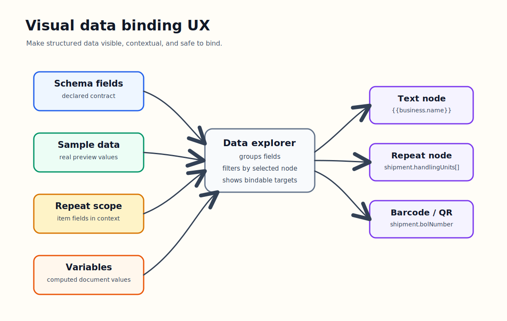

# Building A Visual Data Binding UX



Templara is not only a visual editor.

It is a visual editor for documents that depend on structured data. That changes the UX problem completely.

A normal design tool lets you place text on a canvas. Templara has to let you place text that might come from `business.name`, a barcode that might come from `shipment.bolNumber`, a repeat table that might come from `shipment.handlingUnits`, and a total that might come from a computed variable.

The product has to make data feel visible, understandable, and safe to use.

## The Binding Problem

The simple version of data binding is: insert `{{path.to.field}}`.

That works for developers. It does not scale to a real authoring tool.

A visual authoring platform needs to answer questions while the user is designing:

- What fields exist?
- Which fields are arrays?
- Which fields can I bind to this selected node?
- Am I inside a repeat scope?
- What sample value will this field produce?
- Is this field from the schema, sample data, a repeat item, or a variable?
- Can I drag this field into the canvas?
- Can I insert it into an existing text node?

That is why Templara needs a data binding UX, not just string interpolation.

## The Data Explorer Model

The current data explorer combines four sources:

- declared schema fields
- inferred sample data fields
- current repeat/grid scope fields
- template variables

The model makes those groups explicit:

```ts
export type DataExplorerSource = "schema" | "sample" | "scope" | "variable";
export type DataExplorerGroupId = "scope" | "document" | "variables";

export interface DataExplorerField {
  id: string;
  label: string;
  path: string;
  kind: DataExplorerKind;
  source: DataExplorerSource;
  depth: number;
  bindable: boolean;
  parentPath?: string;
  hasChildren?: boolean;
  childCount?: number;
  displayPath?: string;
}
```

This structure matters because the UI should not treat every path like flat text. A field has type, origin, hierarchy, and binding rules.

The builder function pulls the sources together:

```ts
export function buildDataExplorerModel({
  template,
  data,
  nodeItems = [],
  selectedNodeIds = []
}: BuildDataExplorerOptions): DataExplorerModel {
  const selectedScope = resolveSelectedDataScope(nodeItems, selectedNodeIds);
  const documentFields = decorateFieldHierarchy(
    mergeExplorerFields(
      flattenSchemaFields(template.dataSchema?.fields ?? [], "schema"),
      inferFieldsFromSample(data, "", 0, "sample")
    )
  );
  const variableFields = decorateFieldHierarchy(fieldsFromVariables(template));
  const scopeFields = selectedScope ? fieldsForScope(template, data, selectedScope) : [];
  const groups: DataExplorerGroup[] = [];

  if (scopeFields.length > 0 && selectedScope) {
    groups.push({
      id: "scope",
      title: "Current Scope",
      detail: `${selectedScope.alias} from ${selectedScope.bindingPath}`,
      fields: scopeFields
    });
  }
}
```

The UX result is that the data panel can be contextual. If the user selects a row inside a repeat, the current item fields can rise to the top instead of forcing the user to hunt through the whole document schema.

## Schema Fields And Sample Data

Schema gives intent. Sample data gives reality.

Schema can tell Templara that `shipment.handlingUnits` is an array and `shipment.bolNumber` is text. Sample data can show what those values look like in the current preview.

The data explorer should use both.

If a schema exists, it should be the stable contract. If sample data exists, it should improve the authoring experience by showing realistic values and filling gaps during early template creation.

The product should never force someone to choose between strict modeling and fast iteration. Both are useful.

## Repeat Scope

Repeat scope is where binding UX gets serious.

Imagine a BOL repeat bound to:

```txt
shipment.handlingUnits
```

Inside that repeat row, a field should be able to bind to:

```txt
item.description
item.quantity
item.weight
item.class
```

The data explorer resolves that by walking the selected node's ancestors and finding the nearest repeat or grid:

```ts
export function resolveSelectedDataScope(
  nodeItems: EditorNodeItem[],
  selectedNodeIds: string[]
): DataScope | undefined {
  if (selectedNodeIds.length !== 1) {
    return undefined;
  }

  const selected = nodeItems.find((item) => item.id === selectedNodeIds[0]);

  if (!selected) {
    return undefined;
  }

  const ancestors = nodeItems
    .filter((item) => item.id === selected.id || selected.path.startsWith(`${item.path}.`))
    .filter((item) => item.node.type === "repeat" || item.node.type === "grid")
    .sort((a, b) => b.path.length - a.path.length);
  const nearest = ancestors[0];
}
```

That nearest scope becomes the context for binding suggestions.

This is the difference between a generic template editor and a document authoring tool that understands structured data.

## Binding Rules By Node Type

Not every field can bind to every node.

An array should bind to a repeat or grid. A scalar value should bind to text, barcode, QR, image, or similar value nodes. An object is useful for hierarchy, but usually not directly bindable.

The current rule is explicit:

```ts
export function isFieldBindableForNode(field: DataExplorerField, node?: EditableNode): boolean {
  if (!field.bindable) {
    return false;
  }

  if (!node) {
    return field.kind !== "array" && field.kind !== "object";
  }

  if (node.type === "repeat" || node.type === "grid") {
    return field.kind === "array";
  }

  if (node.type === "text" || node.type === "barcode" || node.type === "qr" || node.type === "image") {
    return field.kind !== "array" && field.kind !== "object";
  }

  return false;
}
```

That kind of constraint makes the UI feel smarter. It also prevents invalid templates before the renderer ever sees them.

## Applying A Binding

Binding is not one operation. It depends on what is selected.

A text node gets field content. A repeat changes its array path. An image changes its source. A barcode or QR code changes its value.

```ts
export function applyDataBindingToNode(node: EditableNode, path: string): void {
  if (node.type === "text") {
    node.content = path ? [{ kind: "field", label: path, binding: { path } }] : [];
    return;
  }

  if (node.type === "repeat") {
    node.binding.path = path;
    return;
  }

  if (node.type === "image") {
    node.source = path ? { kind: "binding", binding: { path } } : { kind: "url", url: "" };
    return;
  }

  if (node.type === "barcode" || node.type === "qr") {
    node.value = path ? { kind: "binding", binding: { path } } : { kind: "literal", value: "" };
  }
}
```

This is why binding should be handled as product logic, not only as text editing. The same data field means different things depending on the document node.

## Drag And Drop Binding

The natural direction is drag and drop:

- drag a scalar field onto the canvas to create a bound text node
- drag a scalar field onto selected text to insert a field run
- drag an array field onto the canvas to create a repeat/table starter
- drag an array field onto an existing repeat to rebind it
- drag an image field onto an image node
- drag a tracking field onto a barcode or QR node

The current helper for creating a bound text node is already shaped for that:

```ts
export function createBoundTextNode(id: string, path: string, point: Pick<Frame, "x" | "y">): TextNode {
  return {
    id,
    type: "text",
    frame: {
      x: Math.max(0, Math.round(point.x)),
      y: Math.max(0, Math.round(point.y)),
      width: Math.max(132, Math.min(280, path.length * 7 + 28)),
      height: 20
    },
    content: [{ kind: "field", label: path, binding: { path } }],
    style: TEXT_NODE_STYLE
  };
}
```

That is the right product feel: a field is not just copied. It becomes a real document object.

## Field Chips

Today, editor text can show handlebars like:

```txt
{{shipment.bolNumber}}
```

That is useful and honest. It makes the template visible.

The next step is field chips:

- show a compact visual token for the binding
- preserve the actual binding path in the template JSON
- allow click-to-edit binding
- show fallback and format state
- warn if the path is missing or incompatible

The key is that field chips should be display affordances, not a new template source of truth. The template should still store structured inline content:

```ts
export type InlineContent = TextRun | FieldRun;

export interface FieldRun {
  kind: "field";
  label: string;
  binding: BindingRef;
  fallback?: string;
  format?: FieldFormat;
}
```

That keeps the editor friendly while keeping the renderer deterministic.

## Variables

Variables are where the data binding UX starts becoming a logic UX.

A variable might represent:

- a formatted total
- a computed subtotal
- a concatenated address
- a tracking URL
- a reusable condition

The data explorer already treats variables as their own field group. That is important because variables are not raw input data. They are document-level computed values.

Over time, variables should become first-class authoring objects with:

- formulas
- descriptions
- preview values
- dependency warnings
- cycle detection
- usage search

## What Good Looks Like

A good visual data binding UX should feel like this:

1. The user opens the data panel.
2. They see document fields grouped by hierarchy.
3. Arrays are visually marked as repeatable.
4. Selecting a repeat row reveals current item fields.
5. Selecting a node filters or disables incompatible fields.
6. Dragging a field creates the right document object.
7. Clicking a bound field shows path, fallback, format, and sample value.
8. Missing or invalid bindings are visible before export.

That is the authoring experience Templara is moving toward.

The big idea is simple: data binding should not feel like writing code inside a design tool. It should feel like connecting structured business data to the document the user can already see.
